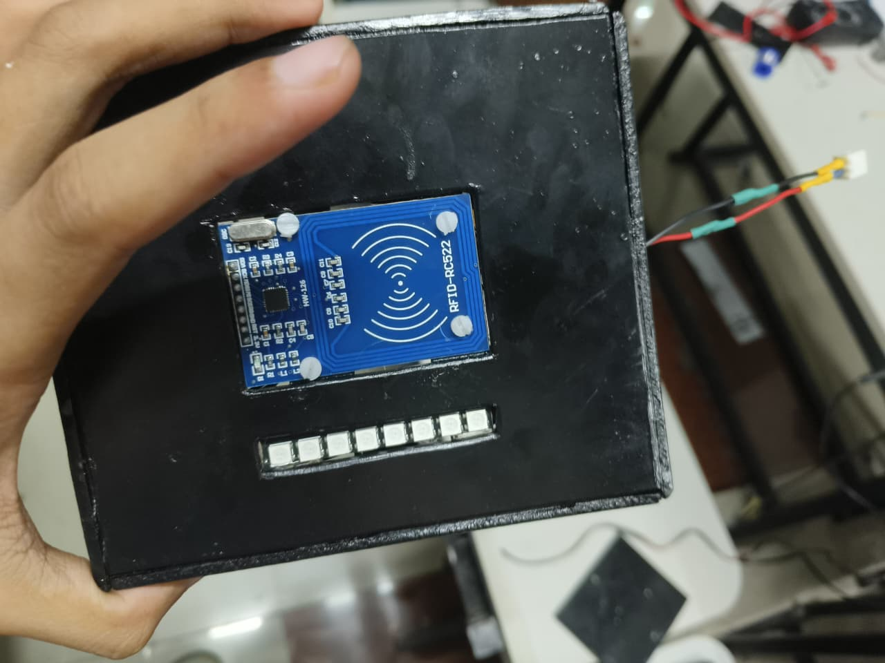
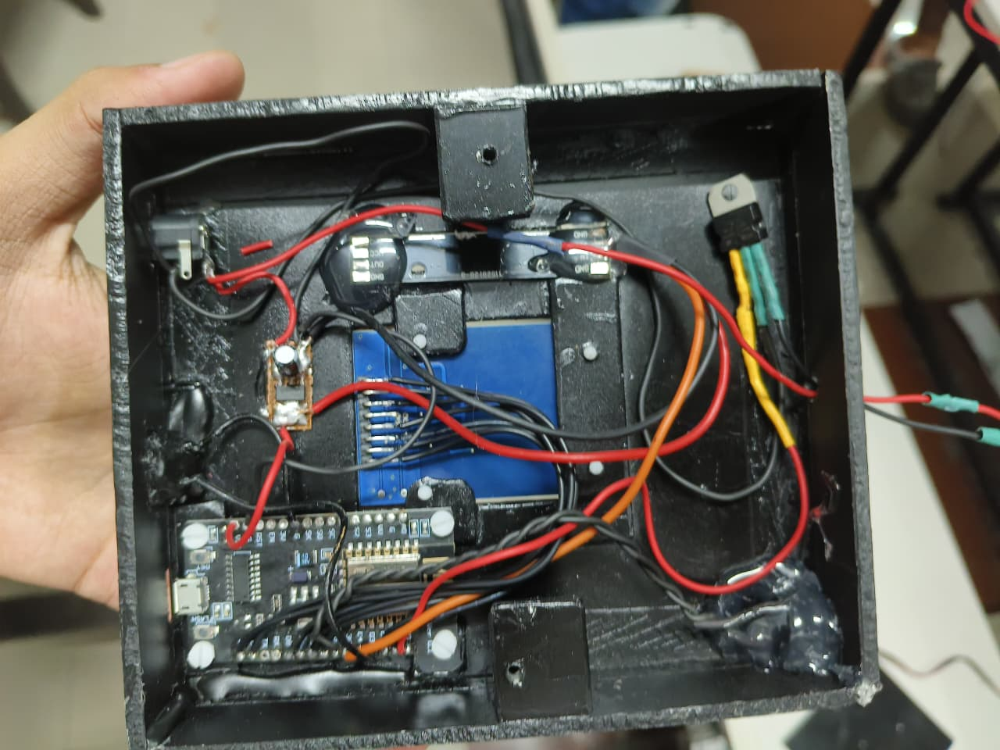

# RFID Door Lock System (ESP8266)

A standalone **RFID-based door access control system** built using **ESP8266**, **MFRC522**, and **LittleFS**.  
The system supports secure door unlocking, admin-authorized UID registration, and a built-in web interface for managing users.

---

## Final Project

---
## Features

- RFID-based access control using MFRC522
- Persistent UID storage using LittleFS
- Role-based access control (`A` = Admin, `U` = User)
- Admin-authorized UID registration mode
- Built-in WiFi Access Point with web interface
- Non-blocking auto-lock with configurable timeout
- Physical mode button with debounce handling
- Audible feedback via buzzer (success / denied)
- Linear actuator control via TIP120 transistor

---

## System Modes

### Door Lock Mode (Default)
- Continuously scans RFID tags
- Grants access if UID exists in storage
- Automatically locks after timeout

### Add New UID Mode
- Activated using the MODE button
- Requires admin RFID card for authorization
- Starts a local WiFi Access Point
- Web interface allows adding new UIDs
- Automatically exits after inactivity timeout

---

## Hardware Required

- ESP8266 (NodeMCU)
- MFRC522 RFID Reader
- RFID Cards / Tags
- Linear Actuator (via TIP120 transistor)
- Buzzer
- Push Button (MODE)
- External power supply (recommended for actuator)

---

## Pin Configuration

| Component         | ESP8266 Pin |
|-------------------|-------------|
| MFRC522 SDA       | D2          |
| MFRC522 RST       | D1          |
| Linear Actuator   | D0          |
| Buzzer            | D8          |
| MODE Button       | D3          |

---

## Web Interface

- **SSID:** `RFID register`
- **Password:** `robotics`
- Automatically starts only in **Add New UID Mode**
- Displays scanned UID in real time
- Allows entering name and role for registration

---

## UID Storage Format

Stored in `/uids.txt` using CSV format:

